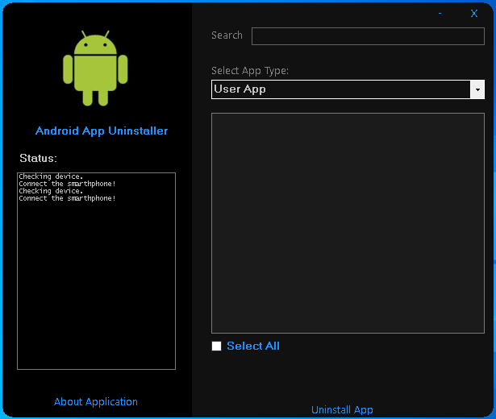

# Android App Uninstaller
Android App Uninstaller is a Windows Forms application designed to uninstall native apps (including system apps) from a computer or laptop with Windows OS installed.

This application uses google's ADB to work, the first time the program is downloaded if the files are missing to work it will download directly from google's website.
You need to activate the USB DEBUG MODE on your smartphone.

The application uses [Ionic.Zip](https://www.nuget.org/packages/Ionic.Zip/) to unzip download ADB.

Preview
-------

Features
---------------
  - Select what type of app you wnat to uninstall (User App or System App).
  - Uninstalling a single app.
  - Uninstalling multiple apps.
  - Search box to find app by package name.
  - Log currenct action.
  - No ROOT needed.

### Donate

If you live in Brazil and liked the project's initiative, you can make a donation via PIX to the following email: jprzimba@gmail.com
You can also donate via [PayPal](https://www.paypal.com/donate/?business=XKPHGJJSTE2RQ&no_recurring=0&currency_code=BRL)

